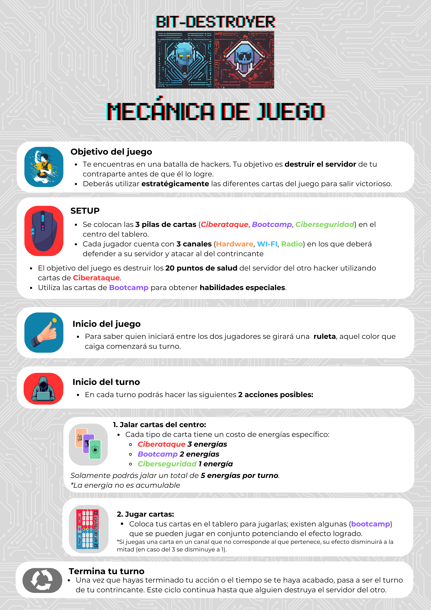
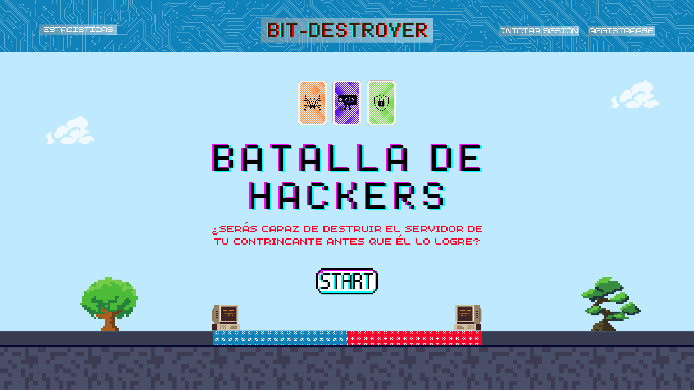
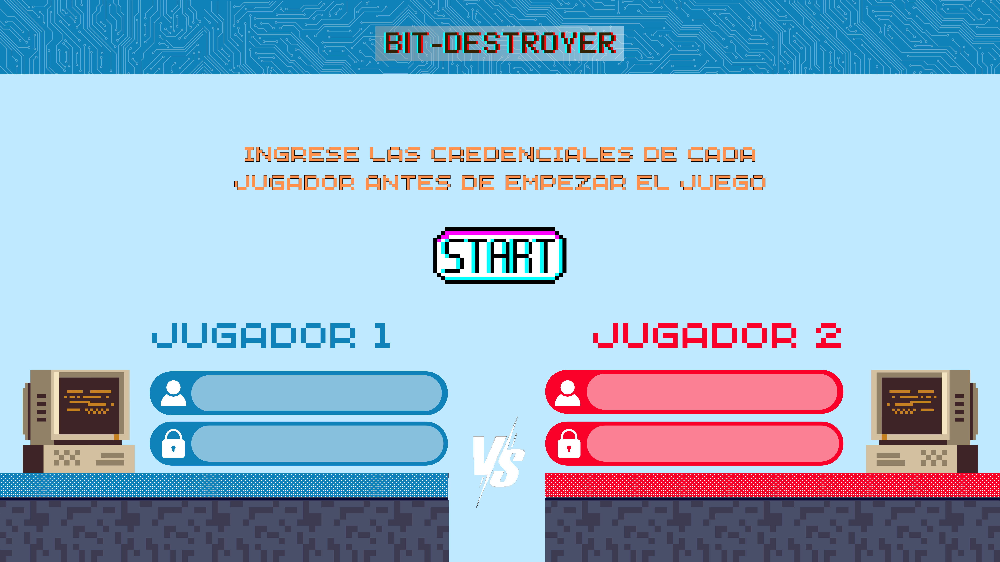
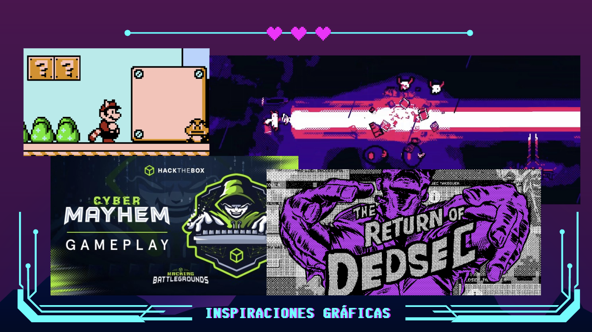
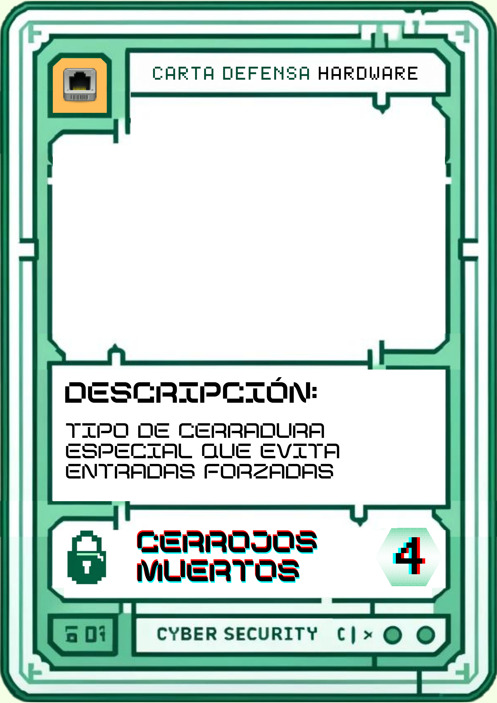

# Idea del Juego

Bit Destroyer es un emocionante juego que combina elementos de hacking y juegos de cartas. El objetivo es simple: protege tus canales de comunicación mientras atacas los de tu enemigo, con el objetivo de debilitar sus defensas y reducir sus puntos de vida a cero. Desarrolla y ejecuta estrategias astutas para competir y ganar la partida.

## Mecánicas

A continuación se presentan las mecanicas detalladas del juego, desde la composición del tablero hasta las acciones de cada turno.

### Creación de una cuenta de jugador
El usuario ingresa a la página web donde está alojado el videojuego, al inicio se mostrara una pantalla de iniciar sesión en caso de ya tener credenciales o registrase en caso de ser un nuevo jugador. Se solicitará un nombre de usuario y una contraseña, si el registro es exitoso se mostrará un mensaje "¡Registro exitoso!", y se direccionará al inicio de sesión. A partir de que se registra se considera jugador.

### Elementos de una partida
Está conformada por dos jugadores uno perteneciente al equipo rojo y otro al azul, hay **tres** lotes de cartas (ciberataque, ciberdefensa y bootcamp), cada jugador **contiene** tres canales de comunicación (radio, cable y wifi) así también cada canal contiene tres ranuras para colocar una carta de ciberseguridad, es decir en total un jugador tiene **nueve** ranuras disponibles para colocar este tipo de cartas. Cada jugador tiene una colección de cartas disponibles (mano) para jugar con un tamaño máximo de **cinco** cartas. Por último, cada jugador contiene cinco puntos de energía para obtener una carta.

### Caracteristicas de una carta

Una carta cuenta con diferentes atributos que ayudan a identificar su función dentro del juego.
  
  1. **Tipo de carta**: ataque, defensa o bootcamp.
  2. **Canal preferido**: cable, radio, wifi.
  3. **Costo de obtención**: cantidad de energía que cuesta obtener la carta para colocarla en mi mano.
  4. **Valor de defensa o ataque**: cantidad de defensa o daño que puede tener una carta según su tipo.
  - Defensa: puede tener un valor de defensa asociado de seis, cuatro o tres puntos según la carta específica.
  -Ataque: puede tener un valor asociado de daño de tres, dos o un puntos según la carta específica.
  5. **Penalización por uso en canal no preferido**: 
  - Se disminuirá el valor de ataque o defensa por la mitad.
  - En caso de que el valor de la carta sea 3 se reducira a 1.

Las cartas **bootcamp** tienen atributos ligeramente distintos a las cartas de ataque o defensa, algunas de ellas pueden combinarse para obtener efectos de defensa o daño superiores, otras pueden jugarse solas teniendo efectos directos en los putos de vida del jugador, estas últimas usualmente son tiradas al centro del tablero. Los efectos específicos de cada una de las cartas bootcamp serán definidos posteriormente.

**¿Comó combinar una carta de defensa o ataque con una tipo bootcamp?**

Selecciona la carta bootcamp que deseas usar para la combinación, después selecciona la carta de ataque o defensa con la que deseas combinarla, si la combinación es posible, un botón aparecerá con la leyenda "¡Combinar!", la carta tendrá un contorno morado denotando su nuevo atributo, ahora puedes jugarla sobre alguna de tus ranuras o las del enemigo si la carta es de ataque.

Para las cartas bootcamp de un solo uso, simplemente colócala en alguna ranura del tablero y te dará los efectos pertinentes.

### Caracteristicas de un jugador

Un jugador dentro de la partida contiene los siguientes atributos:
1. **Colección de cartas disponibles (mano)**: máximo seis cartas en su mano, si este límite es alcanzado la única opción que el jugador tiene es jugar una carta.
2. **Canales a defender**: Cada jugador tiene tres canales distintos que defender (cable, radio y wifi).
3. **Ranuras de defensa**: Cada canal contiene tres ranuras de defensa, en cada ranura solo puede colocarse una carta a la vez. Es decir, el jugador tiene nueve ranuras donde colocar una carta a excepción de las combinaciones con una carta de tipo bootcamp las cuales pueden aumentar los efectos de una carta.
4. **Puntos de vida**: Todos los jugadores tienen veinte puntos de vida asociados.
5. **Puntos de energía**: Todos los jugadores tienen cinco puntos de energía asociados para gastar en la obtención de cartas, la energía no es acumulable.

### Una partida
Comienza con el inicio de sesión o registro de los dos jugadores, posteriormente se posicionan dentro del tablero de juego, automáticamente se gira la ruleta para definir que jugador comienza con el primer turno, debido a ser el primer turno la única opción que tiene el jugador es obtener una carta del lote de tres que están en el tablero, teniendo en cuenta el costo de cada una de ellas según la siguiente tabla.

  | Tipo carta | Costo energía |
  |------------|-------|
  |Ataque     |3 puntos|
  |Bootcamp   |2 puntos|
  |Defensa    |1 punto |

  1. **Obtener una carta**: El jugador decide gastar sus puntos de energía en una carta de cualquier lote, según él decida su estrategia. La carta obtenida va a directo a su colección de cartas disponibles y las podrá colocar en el tablero sin costo extra alguno. **Al terminar este evento el turno cambia al otro jugador.**
  2. **Jugar una carta**: El jugador bajará (arrastrar) su carta correspondiente hacía el tablero, **dependiendo** el tipo de carta que haya elegido será el movimiento, las cartas de tipo defensa solo pueden posicionarse las ranuras de cualquier canal (considerando su efectividad) que no contengan una carta dentro, al colocar una carta dentro de la ranura esta queda protegida con ciertos puntos de defensa. Por otro lado, si la carta es de tipo ataque, esta será arrastrada hacia cualquier ranura del enemigo con el fin de romper sus líneas de defensa. Cuando la carta es colocada sobre la ranura, los puntos asociados a la defensa de esta ranura entraran en juego, pues se verán afectados por la cantidad de daño de la carta atacante (restando puntos de defensa). Si la ranura no está protegida, este daño tendrá efecto en la siguiente ranura sobre el mismo canal de comunicación. Ahora supongamos que la carta es bajada sobre la última ranura del canal de cable, si el valor del daño asociado a la carta de ataque es mayor que el valor asociado a la ranura de defensa, el daño restante irá **directo al jugador.** Una ranura que ha sido atacada y sus defensas han sido quebrantadas completamente, es decir, no se tiene un valor de defensa asociado, pueden volver a protegerse durante el turno correspondiente. **Al terminar este evento el turno cambia automáticamente al otro jugador.**

  **¿Cómo gano una partida?**

  Una partida se gana al terminar por completo con los veinte puntos de vida del contrincante. Si ganas una partida se sumarán puntos a tu perfil general que te posicionaran según el ranking global.

### Las estadísticas
Son necesarias para seguir mejorando la experiencia de juego hacia una más integral y balanceada. Estas serán guardadas en un base de datos y se solicitarán desde cada perfil de jugador. Existirá un tablero de estadísticas personal para cada jugador, el cual se mostrara en la página web una vez iniciada la sesión, donde se listaran las siguientes.

- Nombre de usuario
- Partidas jugadas desde que creo su cuenta
- Partidas ganadas
- Porcentaje de victorias
- Ranking respecto a todos los jugadores

**Enumeración de todas las pantallas que formarán parte del juego**:

1. Pantalla de inicio de sesión
2. Menú principal
3. Pantalla de juego
5. Pantalla de resultados

La pantalla de estadísticas se mostrará en la página web.

## Listado de Assets

Listado detallado de todos los recursos gráficos, auditivos y de otro tipo necesarios para el juego.

- **Gráficos**:
  - Sprites de cartas
  - Tablero de juego
  - Iconos de interfaz (Energía y puntos de vida)
- **Audio**:
  - Música de fondo
  - Efectos de sonido
- **Otros**:
  - Tipografías

## Listado de Clases a Programar

Descripción de las clases que se necesitarán para programar para el juego.

1. Jugador
2. Carta
3. Tablero de juego
4. Controlador de carta
5. Controlador de tablero de juego
6. Partida
7. Conexión a base de datos

## Ilustraciones de las Pantallas, Ambientes

### Pantallas
*Menú de inicio*

*Menúe de inicio de sesión*

*Tablero de juego*

### Ambientes
*Ambientes sobre el cual nos basamos*

### Ejemplos de algunas cartas
*Carta de ataque*

*Carta de defensa*

*Carta bootcamp*

